# Как пользоваться

Здесь два сайта.

**Настройки контента** — сюда кладут фото и тексты, которые потом сами попадают в предложения.  
Адрес: http://72.60.132.88:51004

**Генератор КП** — здесь собирают коммерческое предложение и скачивают PDF.  
Обычно его открывают по ссылке на квоту. Сам по себе он здесь: http://72.60.132.88:51003

---

## 1. Собрать предложение

1. Откройте ссылку на квоту.
2. Нажмите язык: **RU**, **UA** или **ENG**.
3. Нажмите шаблон: **Dental**, **Пластика лица** или **Пластика**.
4. Нажмите зелёную кнопку **Далее**.

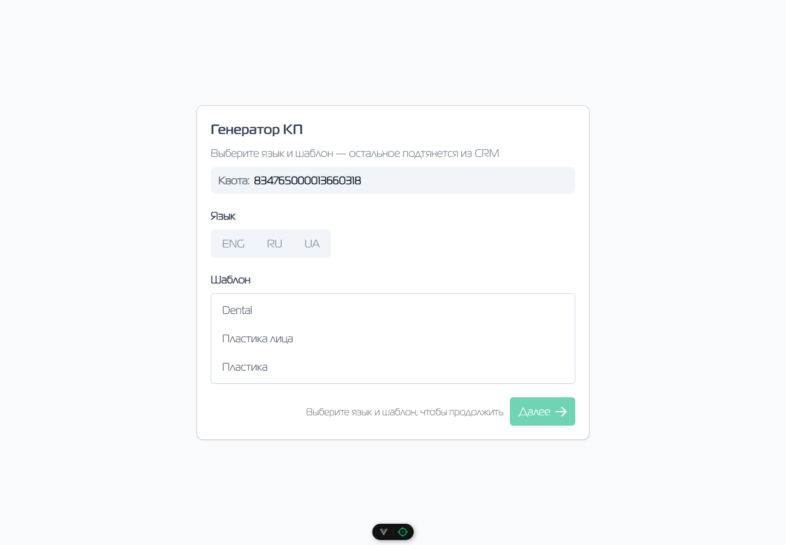

Откроется редактор.

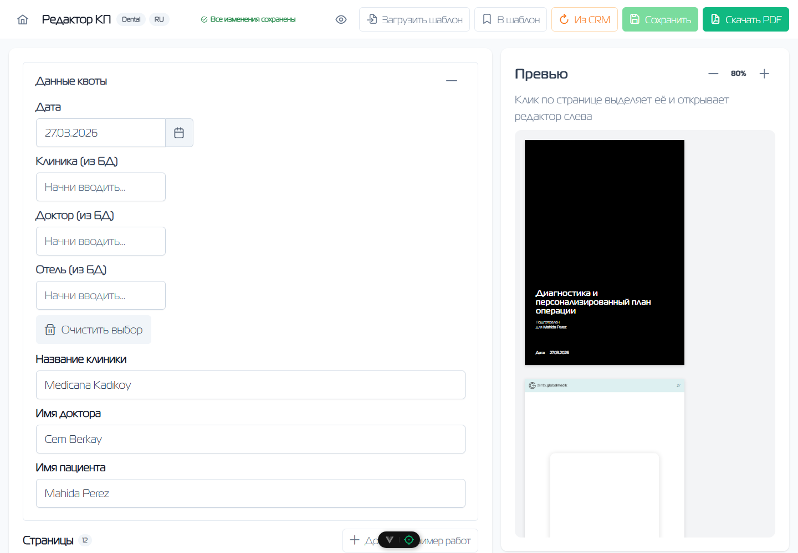

5. Слева список страниц. Нажмите нужную — она откроется и слева, и в превью справа.
6. Поправьте текст.
7. Когда сверху написано **Все изменения сохранены**, нажмите **Скачать PDF**.

Если сверху горит **Есть несохранённые изменения**, сначала нажмите **Сохранить**.

Если имя, клиника, доктор или тексты не обновились и на экране старое — нажмите оранжевую кнопку **Из CRM** справа вверху. Она заново забирает данные. То, что вы уже руками поправили в этой квоте, при этом заменится на свежие данные.

Значок глаза слева от **Загрузить шаблон** открывает предложение целиком, без полей редактора. Так удобно проверить, как страница выглядит перед PDF.

---

## 2. Не та клиника, доктор или отель

Слева блок **Данные квоты**.

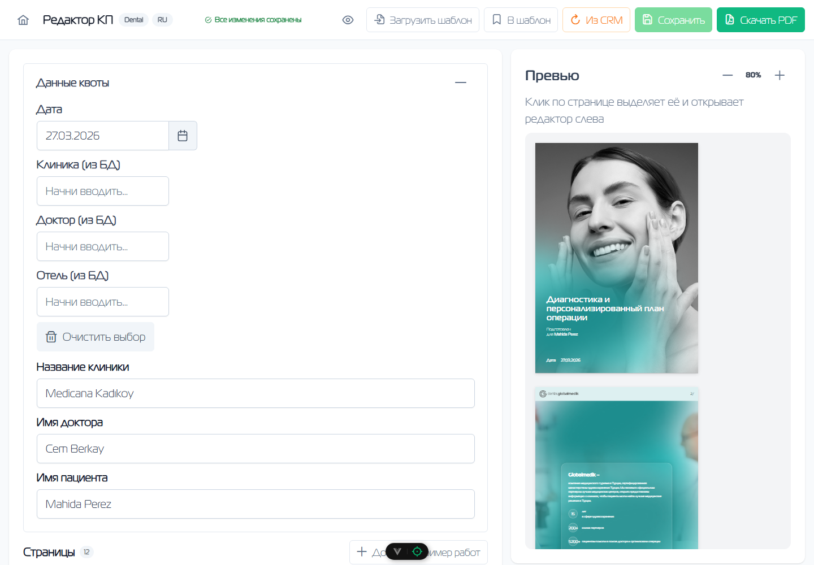

1. В поле **Клиника (из БД)**, **Доктор (из БД)** или **Отель (из БД)** начните вводить название.
2. Нажмите нужную строку в выпавшем списке. Имя, фото и тексты подставятся из настроек.
3. **Очистить выбор** сбрасывает эти три поля.
4. Ниже можно поправить **Название клиники**, **Имя доктора** и **Имя пациента** руками, если в строке опечатка.
5. **Дата** — день на обложке. Нажмите на календарь и выберите день.

Если после выбора на превью всё ещё старое, нажмите **Из CRM**.

---

## 3. Фото пациента

Это фото только этой квоты. В настройки их класть не нужно.

1. Слева нажмите страницу **Профиль пациента**.
2. При необходимости заполните **Возраст**, **Страна** и **Пол**.
3. Ниже шесть клеток: **Фото 1** … **Фото 6**. Пустая клетка на превью справа — белый квадрат.
4. Нажмите **Upload** у нужной клетки и выберите картинку. Откроется обрезка.
5. **Кадрировать** — обрезать ещё раз. **Clear** — убрать фото.

Поле со ссылкой под кнопками можно не заполнять. Достаточно **Upload**.

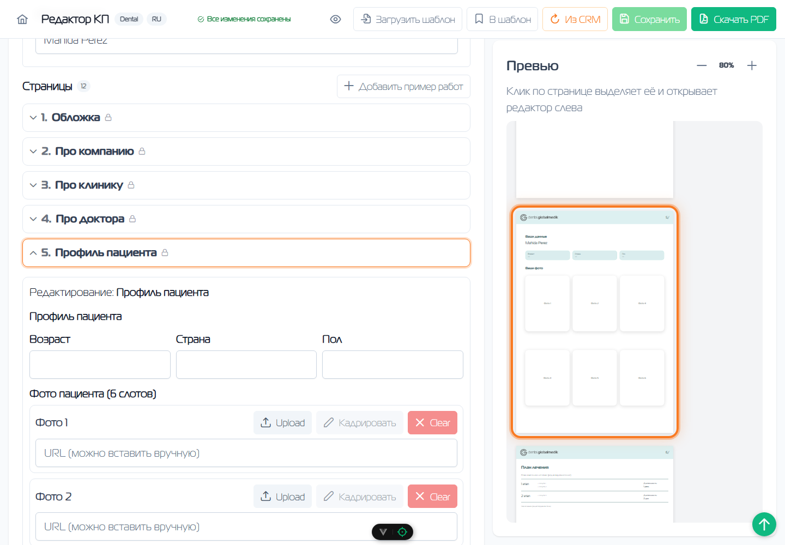

---

## 4. Страницы

Список слева — это страницы предложения. Нажмите строку, чтобы открыть её.

У страницы с замочком нет кнопок удаления. Такую страницу нельзя убрать и нельзя переставить. Это обложка, доктор, цена и остальные обязательные листы.

У дополнительной страницы, например **Примеры работ**, справа четыре кнопки:

- стрелка вверх — поднять страницу;
- стрелка вниз — опустить;
- копировать — сделать такую же страницу ещё раз;
- корзина — убрать страницу. Программа спросит подтверждение.

Новую страницу с примером работ добавляет кнопка **Добавить пример работ** над списком.

---

## 5. Один раз заполнили — подставить в другую квоту

Сверху две кнопки: **В шаблон** и **Загрузить шаблон**.

Шаблон запоминается для того же типа и языка. Сохранили в Dental на русском — в квоте «Пластика» или на английском этого шаблона не будет.

### Сохранить

1. Нажмите **В шаблон**.
2. Впишите понятное **Название**.
3. Галочками оставьте страницы, которые нужно запомнить. **Выбрать все** отмечает все, **Снять все** снимает.
4. Нажмите **Сохранить**. **Отмена** — ничего не записывать.

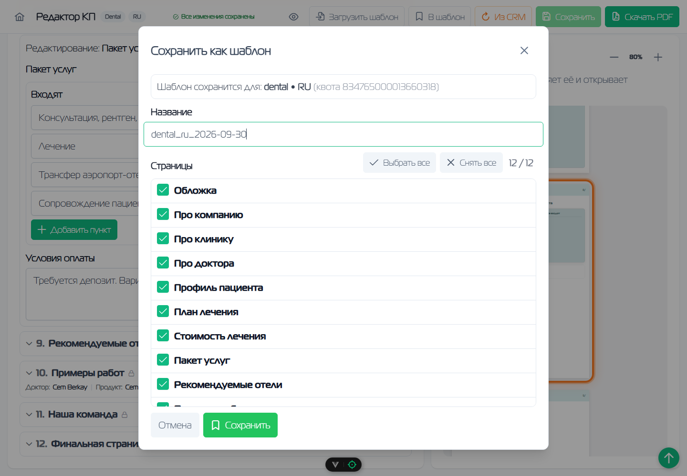

### Подставить

1. Откройте другую квоту с тем же языком и тем же шаблоном.
2. Нажмите **Загрузить шаблон**.
3. Нажмите сохранённое название.
4. В списке **Как применяем**:
   - **Добавить недостающее** — заполняет только пустые места, уже написанное не трогает;
   - **Заменить выбранное** — подставляет поверх того, что уже есть.
5. Снимите галочки со страниц, которые менять не нужно.
6. Нажмите **Применить**.

**Удалить** в этом окне убирает сам шаблон. Квота при этом не удаляется. **Обновить** — перечитать список.

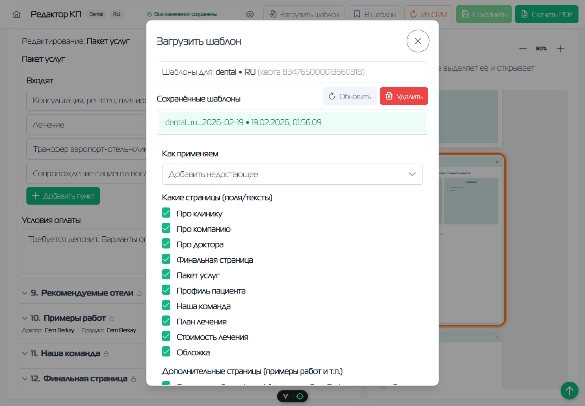

---

## 6. Цена и что входит в пакет

### Стоимость

1. Слева нажмите **Стоимость лечения**.
2. В таблице поправьте **Название**, **Кол-во**, **Цена** и **Скидка** в строке.
3. **Добавить строку** — ещё одна позиция. Корзина в конце строки — убрать позицию.
4. Поле **Скидка** под таблицей — скидка на всю сумму. Ниже сами посчитаются **Подытог** и **Итого**.

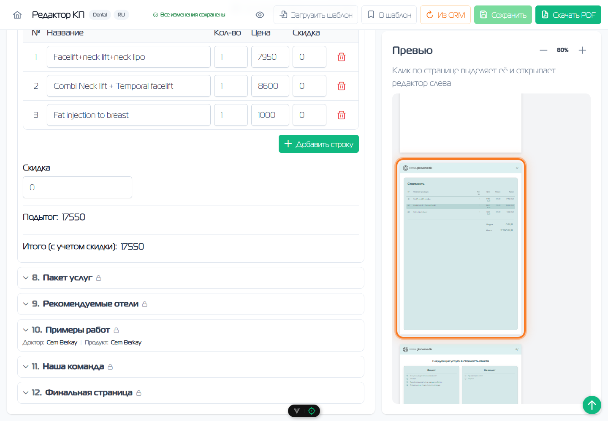

### Что входит и что нет

1. Нажмите страницу **Пакет услуг**.
2. Слева колонка **Входят**, справа **Не входят**.
3. Поправьте текст в строке. **Добавить пункт** — новая строка. Корзина — убрать строку.
4. Внизу **Условия оплаты** — как платить. Этот текст попадает на ту же страницу предложения.

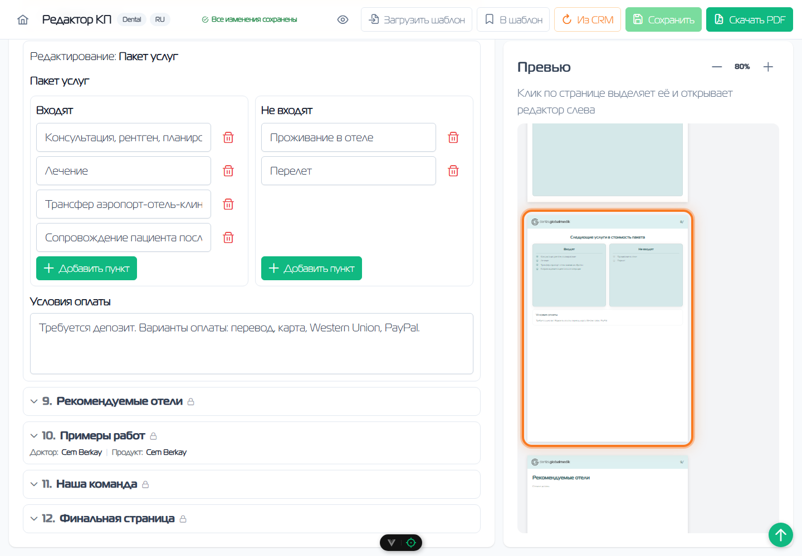

---

## 7. Если в предложении пустое фото

Пустое место выглядит так: серый квадрат, надпись **Фото не загружено** или **Фото пока не добавлены**.

Сначала посмотрите, чьё это фото.

- Портрет доктора, фото клиники, фото отеля, обложки видео и примеры работ — их кладут в **Настройки**. Тогда они появятся во всех новых предложениях.
- Фото только этой квоты (например фото пациента) — его загружают прямо в редакторе, на открытой странице слева. Кнопка называется **Upload**.

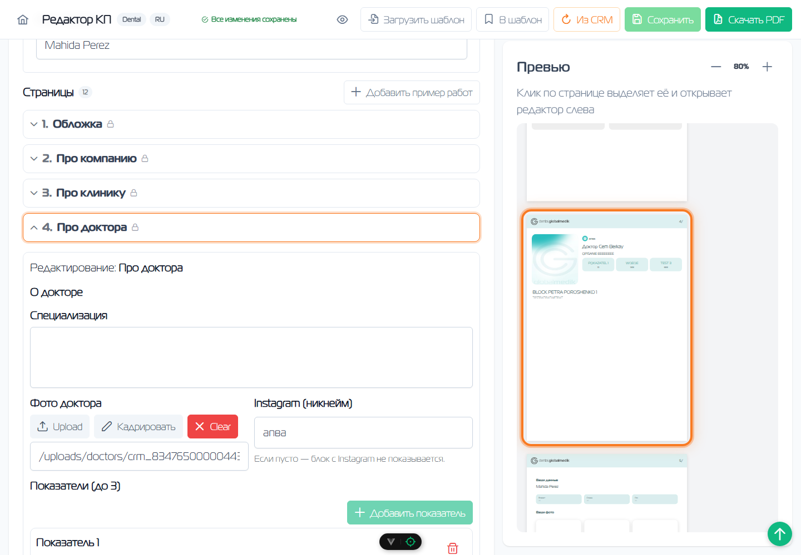

Дальше — куда заходить в настройках.

---

## 8. Настройки: с чего начать

Откройте http://72.60.132.88:51004

На главной нажмите карточку, где не хватает фото: **Доктора**, **Отели**, **Клиники** или **Продукты**.

На карточке справа кнопки **RU**, **ENG** и **UA**. Включите тот же язык, что в квоте, и заполните текст. Потом нажмите зелёную **Сохранить** вверху. Без этого в предложении останется старый или пустой текст. Фото сохраняется сразу после обрезки, для картинки отдельно жать **Сохранить** не нужно.

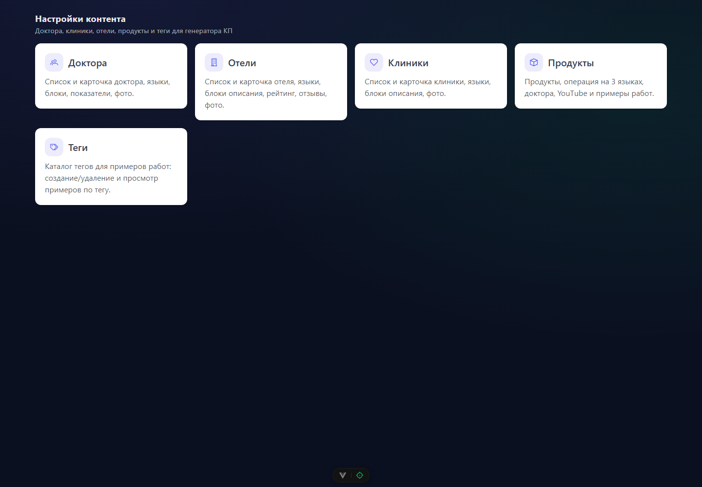

---

## 9. Пустое фото доктора

1. Нажмите **Доктора**.
2. Найдите имя в поиске справа.
3. Нажмите зелёную **Открыть** в этой строке.

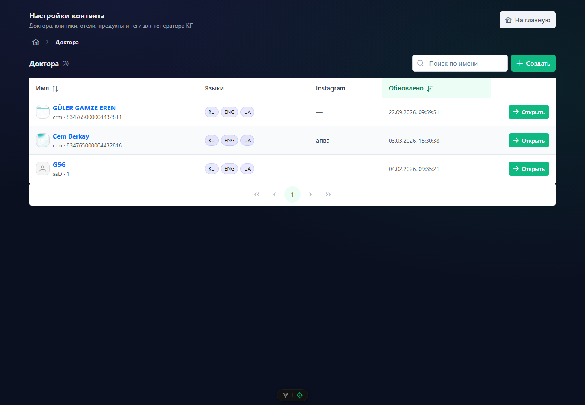

4. Слева блок **Фото профиля**. Если написано **Фото не загружено** — фото нет.
5. Нажмите зелёную **Загрузить / заменить**.
6. Выберите картинку на компьютере.

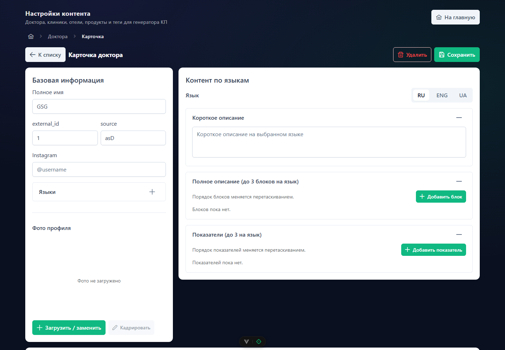

7. Откроется окно **Кадрирование фото доктора**. Синяя рамка — это кусок, который попадёт в документ. Потяните рамку мышью, чтобы лицо было внутри. Нажмите **Применить**.
8. Если передумали — **Отмена**. Фото тогда не сохранится.

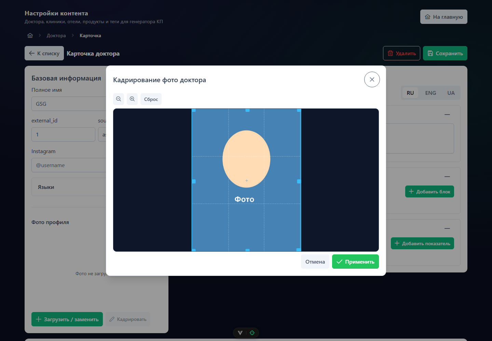

Кнопка **Кадрировать** под уже загруженным фото — обрезать заново.  
**Удалить** справа от «Фото профиля» — убрать картинку.

### Фото команды под карточкой доктора

Прокрутите страницу вниз до блока **Фото команды доктора**.

Если написано **Фото пока не добавлены**:

1. Нажмите **Добавить фото**.
2. Выберите одну или несколько картинок.
3. В окне обрезки подвиньте рамку и сохраните.

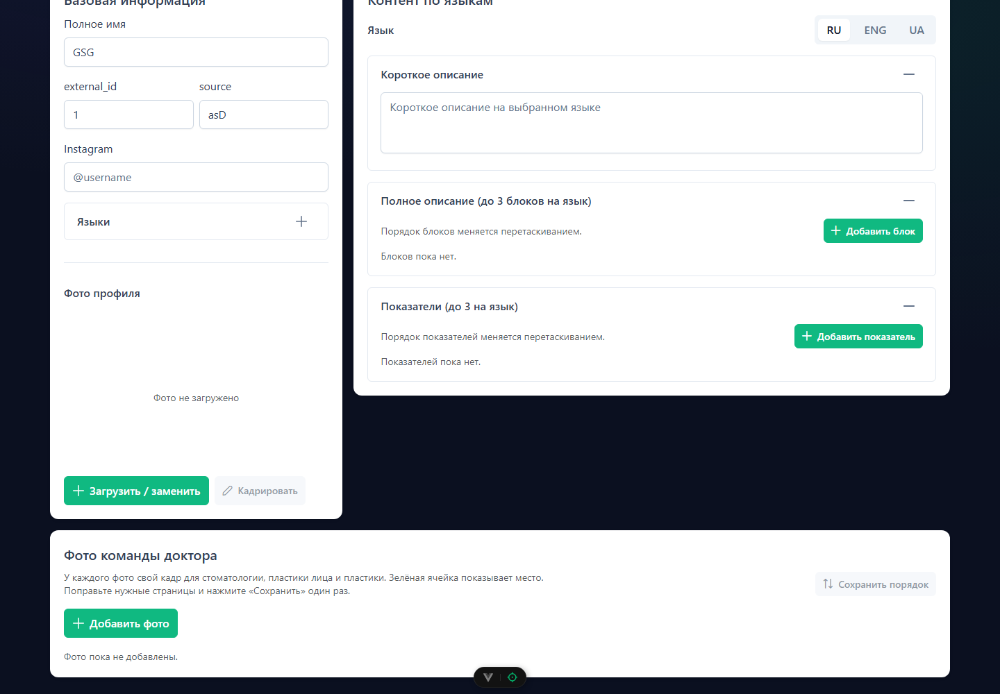

Порядок меняется перетаскиванием за полоски слева от фото. Потом нажмите **Сохранить порядок**.

---

## 10. Пустые фото клиники

1. На главной нажмите **Клиники**.
2. Нажмите **Открыть** у нужной клиники.
3. Прокрутите до блока **Фото клиники**.
4. Если написано **Фото пока не добавлены** — нажмите **Добавить фото** и обрежьте картинку так же, как у доктора.

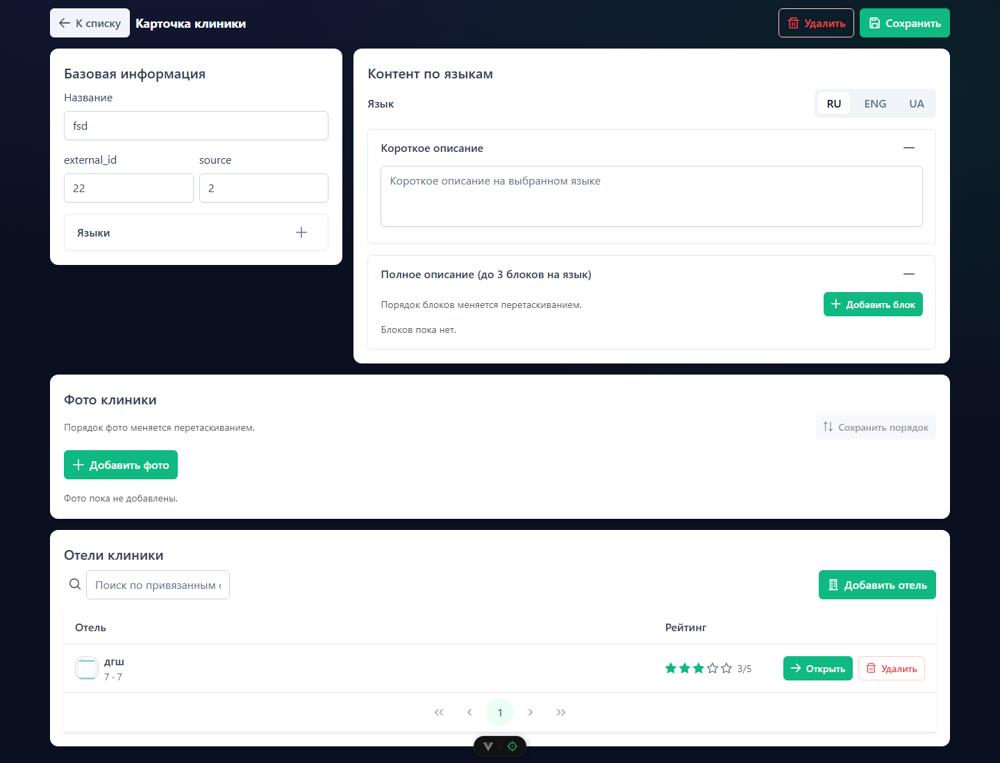

---

## 11. Пустые фото отеля

1. На главной нажмите **Отели**.
2. Нажмите **Открыть**.
3. Прокрутите до **Фото отеля**.
4. Нет ни одной картинки — **Добавить фото**.
5. Картинка есть, но не та — **Заменить**.
6. Картинка криво обрезана — **Кадр**.
7. Красная корзина — удалить это фото.
8. **Ссылка на отзывы** — адрес страницы с отзывами. Вставьте его и нажмите зелёную **Сохранить** вверху карточки. Без этой ссылки кнопка отзывов на странице отелей в предложении серая и не нажимается. Потом в квоте нажмите **Из CRM**, иначе старая квота ссылку не увидит.

На страницу «Рекомендуемые отели» попадает не сам список фото отеля, а отель, который привязан к клинике. Как привязать — в разделе «Откуда программа берёт картинки».

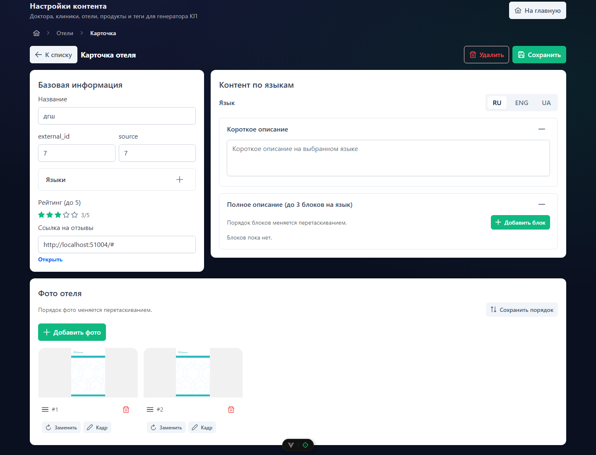

---

## 12. Пустые обложки и примеры работ

Это фото операции: обложки роликов и снимки «до / после». Они лежат не у доктора, а у **продукта**.

1. На главной нажмите **Продукты**.
2. Нажмите **Открыть** у нужной операции.

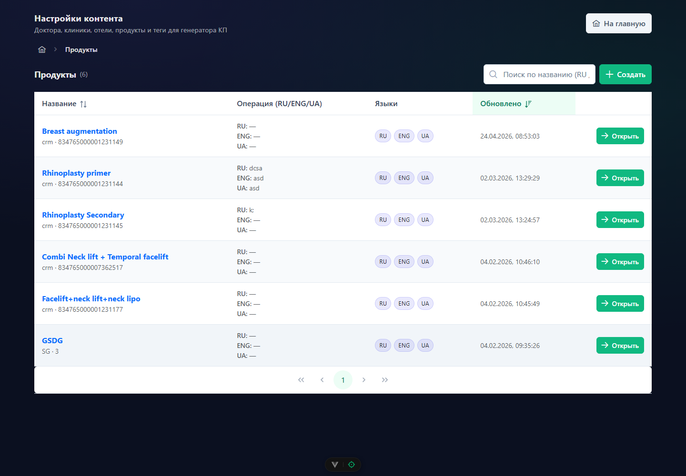

3. Справа вверху нажмите вкладку **Доктора**.
4. У нужного врача нажмите **Открыть**.

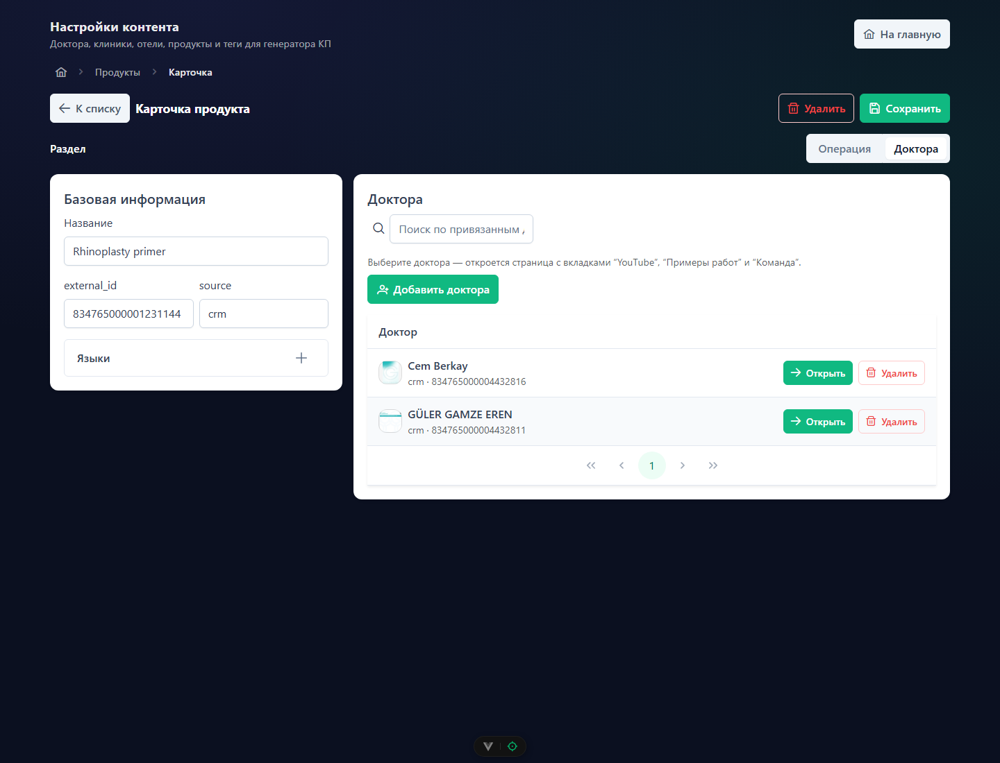

Дальше три вкладки справа: **YouTube**, **Примеры работ**, **Команда**.

### Обложки YouTube

Пустой слот — серый квадрат и текст **Фото не загружено**.

1. Нажмите **Загрузить** под этим слотом.
2. Выберите картинку и обрежьте её.
3. В поле **Ссылка на видео** вставьте адрес ролика и кликните мышкой в другое место — ссылка сохранится сама.

Заставка на странице «Наш Youtube» нажимается только если под ней есть ссылка. Фото без ссылки на странице видно, но кликнуть его нельзя: ролик не откроется. Ссылка без фото тоже не показывается.

Четыре слота. На страницу попадают первые три. Четвёртая обложка на страницы предложения не попадает.

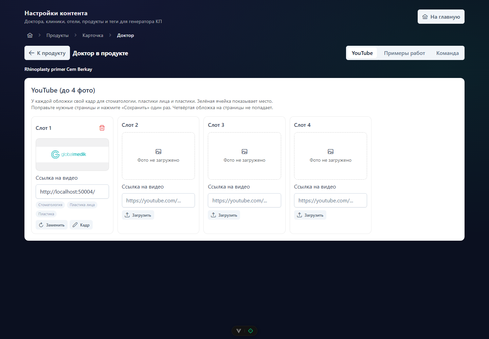

Уже загруженное фото: **Заменить** — новая картинка, **Кадр** — обрезать заново, корзина — удалить.

### Примеры работ

Фото «до / после» лежат здесь. Пока слот пустой, в предложении на этом месте будет дырка.

#### Примеров нет совсем

На вкладке **Примеры работ** написано **Примеров пока нет**. Списка строк нет.

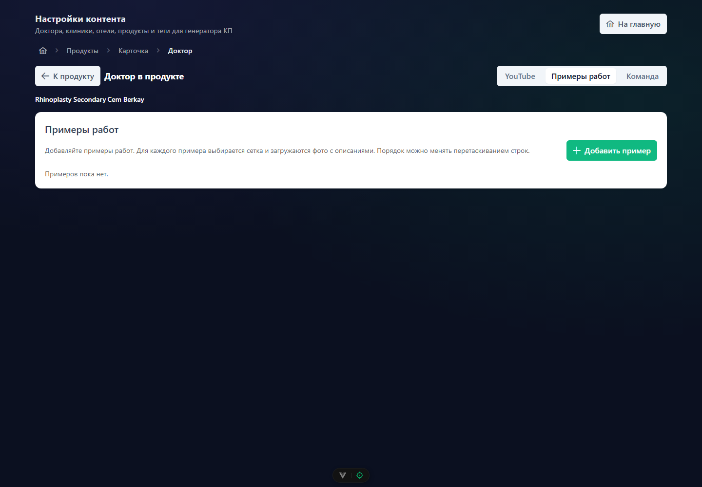

1. Нажмите зелёную **Добавить пример**.
2. Откроется окно **Новый пример работ**. Выберите сетку:
   - **1 фото** — одна картинка;
   - **2 вертикальных** — две картинки рядом;
   - **2 горизонтальных** — две картинки одна под другой;
   - **4 фото** — четыре клетки.
3. Нажмите **Создать**. **Отмена** — ничего не добавлять.

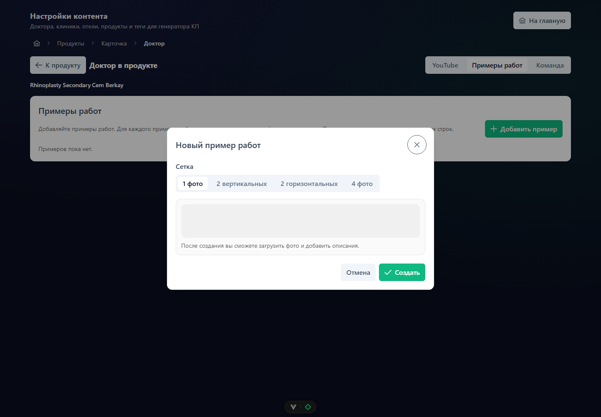

После создания строка появляется, но фото внутри ещё пустые. Их нужно загрузить отдельно, сетка сама картинки не подставляет.

#### Пример есть, а фото пустые

В колонке **Превью** серый значок картинки. Это пустой слот.

1. Нажмите стрелку слева от строки. Строка раскроется.
2. В каждой пустой клетке написано **Фото**. Нажмите **Загрузить** и выберите картинку.
3. Обрежьте её и сохраните.
4. Заполните все клетки выбранной сетки. Одна пустая клетка — одна дырка в PDF.
5. Описание под фото пишется только после картинки. Пока фото нет, поле серое и там написано **Сначала загрузите фото**.

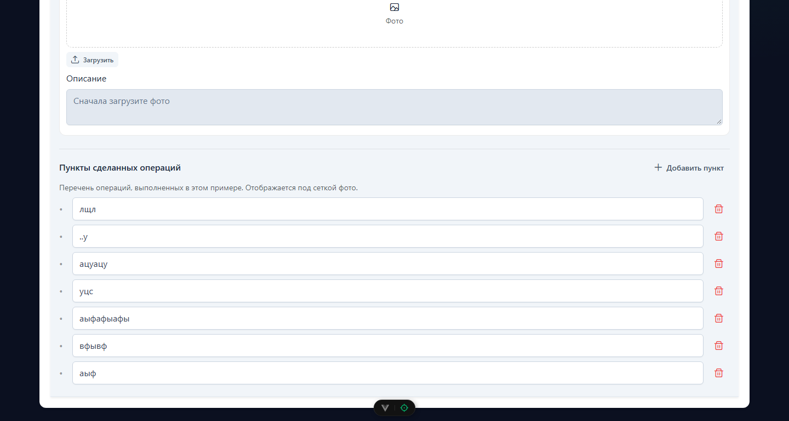

Дальше по желанию:

- **Пункты сделанных операций** — строки под фотографиями. **Добавить пункт**, вписать текст, кликнуть мышкой рядом. Текст сохранится сам. Красная корзина у строки убирает только этот пункт.
- Красная корзина справа в строке примера удаляет пример целиком.
- Полоски слева от строки — перетащите, чтобы поменять порядок примеров.
- Уже загруженное фото: **Заменить** — новая картинка, **Кадр** — обрезать заново.

#### В самой квоте страницы нет или она пустая

Откройте квоту и посмотрите список страниц слева.

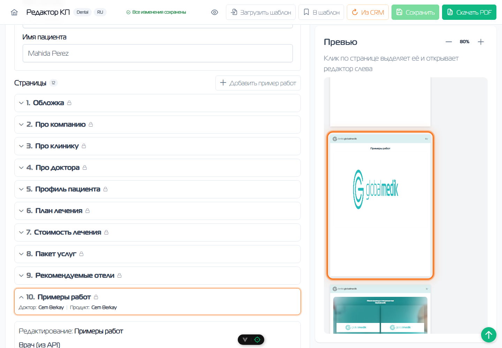

- Страницы **Примеры работ** нет в списке. Нажмите **Добавить пример работ**. Появится новая страница, клетки на ней пустые.
- Страница есть. Нажмите на неё. Справа в превью смотрите, есть ли картинка. Слева серый квадрат с текстом **Нажми, чтобы загрузить** — нажмите на него и выберите файл. Откроется обрезка.
- Поле **Layout** — та же сетка: **1 фото**, **2 вертикально**, **2 горизонтально**, **4 фото**. Поменяли сетку — пустые новые клетки тоже нужно заполнить.
- Картинка уже стоит, но не та: **Заменить**. Обрезать заново: **Кадрировать**. Убрать: **Убрать**.
- **Пункты сделанных операций** внизу этой страницы. Если пунктов нет, в PDF этот блок не печатается. **Добавить пункт**, вписать текст.

При **Скачать PDF** может выскочить окно **Есть незаполненные фото**. Там написано, сколько пустых клеток осталось в примерах работ.

- **Вернуться к редактированию** — вернуться и доложить картинки.
- **Скачать как есть** — PDF скачается с дырками.

Вкладка **Команда** — те же шаги, что «Фото команды доктора»: **Добавить фото**, обрезать, при необходимости **Сохранить порядок**.

---

## 13. Откуда генератор берёт картинки

PDF строится из уже сохранённой квоты. Заново скопировать фото из настроек она может в двух случаях: квоту открыли в первый раз или в редакторе нажали **Из CRM**. Дальше — откуда именно копируется каждая картинка.

Картинка, которую загрузили прямо в квоте кнопкой **Upload**, остаётся только в этой квоте. В карточку врача, отеля или продукта она сама не записывается.

### Портрет на странице «Про доктора»

Берётся **Фото профиля** из карточки врача: **Настройки** → **Доктора** → **Открыть**.

### Страница «Наша команда»

Клеток четыре в шаблоне Dental и пять в шаблонах «Пластика» и «Пластика лица».

1. Сначала фото со вкладки **Команда** у этого врача внутри продукта. Путь: **Продукты** → операция из квоты → **Доктора** → **Открыть** → **Команда**.
2. Если в квоте несколько операций, сначала берётся по одной картинке с каждой, в том порядке, как операции стоят в квоте. Потом добираются следующие фото тех же операций.
3. Если клеток ещё не хватает, добирает из блока **Фото команды доктора** в карточке самого врача.
4. Если вкладка **Команда** у продукта уже заполнила все клетки, фото из карточки врача на эту страницу не попадают.

### Страница «Наш Youtube»

Из карточки врача эти обложки не берутся. Только вкладка **YouTube** у врача внутри продукта.

1. Сначала по одной обложке с каждой операции в квоте.
2. Если трёх не набралось, добирает следующие слоты тех же операций.
3. На страницу идут три штуки. У каждой на странице виден клик только вместе со ссылкой под фото.
4. Четвёртый слот на страницу не ставится.

### Примеры работ

Тоже только из продукта, не из карточки врача: вкладка **Примеры работ** у врача внутри операции.

Берутся по очереди операции из квоты. Внутри операции — в том порядке, в каком примеры лежат в списке. Страниц с примерами в одной квоте не больше десяти. Пустая клетка в примере так и остаётся дыркой в PDF.

### Рекомендуемые отели

1. Отель должен быть в блоке **Отели клиники** у клиники этой квоты: **Настройки** → **Клиники** → **Открыть** → **Добавить отель**.
2. Картинка отеля — первая фотография в его карточке. Остальные фото этой странице не нужны.
3. Кнопка отзывов берёт поле **Ссылка на отзывы** из той же карточки. Поле пустое — кнопка есть, но серая.

Фото, загруженные в отель, но не привязанные к клинике, на эту страницу не выходят.

### Фото клиники

Страница про клинику берёт фото из карточки клиники, сверху вниз, как они стоят в блоке **Фото клиники**.

### Фото пациента

Только из этой квоты, страница **Профиль пациента**, кнопка **Upload**. В настройках такого блока нет.

---

## 14. После того как фото положили

1. Вернитесь в генератор и откройте квоту снова.
2. Откройте страницу, где фото было пустым, и посмотрите превью справа.
3. Если новая картинка или текст не появились — нажмите **Из CRM** и подождите, пока страница загрузится заново. Потом снова откройте эту страницу.
4. Если картинка на месте — **Скачать PDF**.

Если при скачивании вылезло окно про пустые фото в примерах работ, нажмите **Вернуться к редактированию**. Откройте страницу **Примеры работ** или вкладку с тем же названием в настройках продукта и загрузите картинку в каждый серый слот. Потом скачайте PDF ещё раз.
